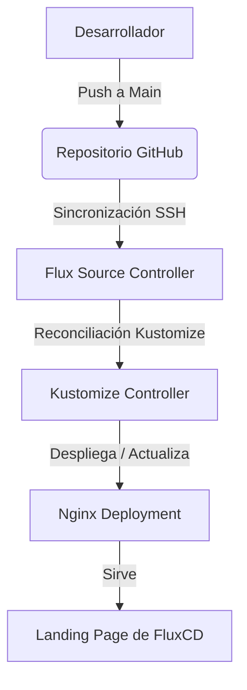

# 🚀 Frontend Stitch - GitOps & FluxCD

[](https://kubernetes.io)
[](https://fluxcd.io)
[](https://nginx.org)
[](https://tailwindcss.com)

Este repositorio es una plantilla de **GitOps declarativo** configurada para desplegar y reconciliar de manera automática una Landing Page premium sobre **FluxCD** en un clúster de Kubernetes (`expo-flux`).

El clúster está configurado para auto-sincronizarse con este repositorio utilizando Flux v2, asegurando que cualquier cambio en la configuración se aplique de inmediato sin intervención manual.

---

## 📂 Estructura del Proyecto

El repositorio está estructurado siguiendo las mejores prácticas de GitOps y la modularidad de Flux:

```text
├── apps/
│   └── nginx.yaml             # Despliegue de Nginx, Servicio y ConfigMap con la Landing Page
├── clusters/
│   └── expo-flux/
│       ├── apps.yaml          # Kustomization que apunta al directorio /apps
│       └── flux-system/       # Componentes del sistema generados por Flux
│           ├── gotk-components.yaml
│           ├── gotk-sync.yaml
│           └── kustomization.yaml
├── index.html                 # Código fuente local de la landing page para desarrollo
└── README.md                  # Documentación del proyecto
```

---

## 🏗️ Flujo de GitOps (Arquitectura)



### Componentes Desplegados:
1. **Nginx Deployment:** Mantiene dos réplicas altamente disponibles del servidor Nginx.
2. **Kubernetes Service:** Expone el puerto 80 del servidor web en el clúster.
3. **ConfigMap (`nginx-html`):** Contiene el código HTML/Tailwind inyectado directamente en el directorio `/usr/share/nginx/html` de Nginx.

---

## ⚡ ¿Cómo Replicar o Desplegar este Clúster?

Para inicializar tu propio clúster utilizando este repositorio de GitOps, asegúrate de tener instalado el CLI de `flux` y acceso a tu clúster de Kubernetes, y ejecuta:

```bash
flux bootstrap github \
  --owner=galeyro \
  --repository=frontend-stich \
  --branch=main \
  --path=./clusters/expo-flux \
  --personal
```

Este comando:
1. Instalará los controladores de Flux en el espacio de nombres `flux-system`.
2. Configurará una llave de despliegue SSH en tu repositorio de GitHub para permitir la sincronización automática y segura.
3. Comenzará a monitorear la ruta `./clusters/expo-flux` para desplegar las aplicaciones.

---

## 🎨 Características de la Landing Page

La landing page incluida en el ConfigMap y en `index.html` es una interfaz premium y ultra-moderna que incluye:
* **Estilo Glassmorphic y Oscuro:** Diseñado con una paleta de colores HSL refinada.
* **Glow Interactivo:** Un efecto de iluminación dinámica que sigue el movimiento del mouse.
* **Sistema de Partículas:** Animaciones de fondo premium renderizadas dinámicamente con Canvas.
* **Responsive Completo:** Optimizada para dispositivos móviles y pantallas de alta definición mediante Tailwind CSS.

---

## 🔗 Integración con Stitch (MCP)

Este proyecto ha sido vinculado y diseñado utilizando **Stitch** a través de la integración del **Model Context Protocol (MCP)**. Esto nos permite conectar el flujo de diseño visual de Stitch de forma directa con la generación automatizada de manifiestos y pantallas en Kubernetes, logrando un flujo de desarrollo continuo e interactivo.

---

## 🌐 ¿Cómo Visualizar la Landing Page? (Redirección de Tráfico)

Por defecto, el servicio de Nginx se despliega dentro de Kubernetes con el tipo `ClusterIP` (es decir, solo es accesible internamente dentro del clúster). Para redirigir el tráfico del servidor Kubernetes y poder ver la página desde tu máquina local, tienes las siguientes opciones:

### Opción 1: Redirección de Puertos (Port-Forward) - *Recomendado para pruebas rápidas*
Puedes mapear el puerto de tu máquina local directamente al servicio de Kubernetes ejecutando el siguiente comando:
```bash
kubectl port-forward svc/nginx 8080:80
```
Una vez ejecutado, abre tu navegador e ingresa a: **[http://localhost:8080](http://localhost:8080)**.

### Opción 2: Exponer el Servicio como LoadBalancer
Si tu clúster de Kubernetes está en la nube o usas una distribución local con soporte para balanceadores de carga (como Minikube con `minikube tunnel` o Kind con MetalLB), puedes editar el archivo `apps/nginx.yaml` y añadir `type: LoadBalancer` en la especificación del servicio:
```yaml
spec:
  type: LoadBalancer
  selector:
    app: nginx
  ports:
    - port: 80
      targetPort: 80
```
Una vez que el clúster se reconcilie, obtén la dirección IP pública con:
```bash
kubectl get svc nginx
```

### Opción 3: Exponer mediante un Ingress Controller
Para despliegues productivos, puedes crear un recurso de `Ingress` que apunte al servicio `nginx` en el puerto `80` para enrutar el tráfico externo a través de tu nombre de dominio preferido.

